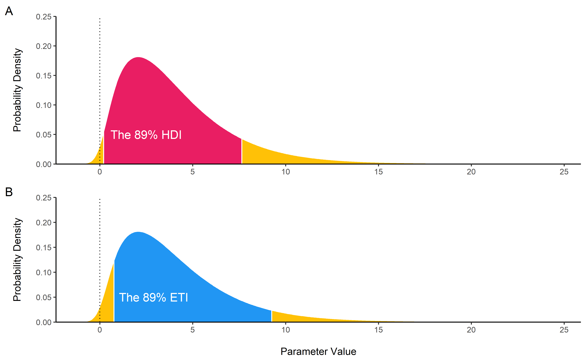
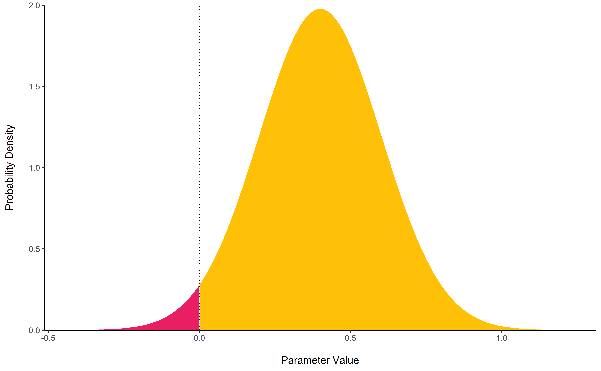
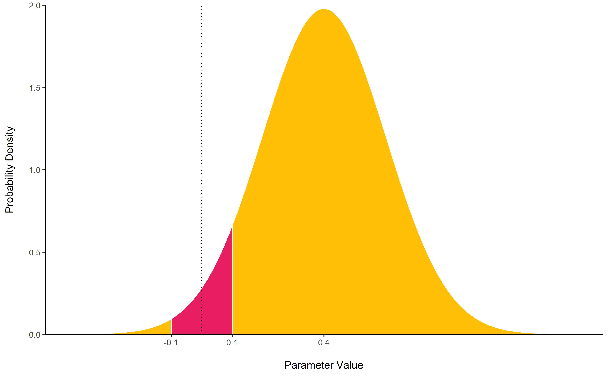
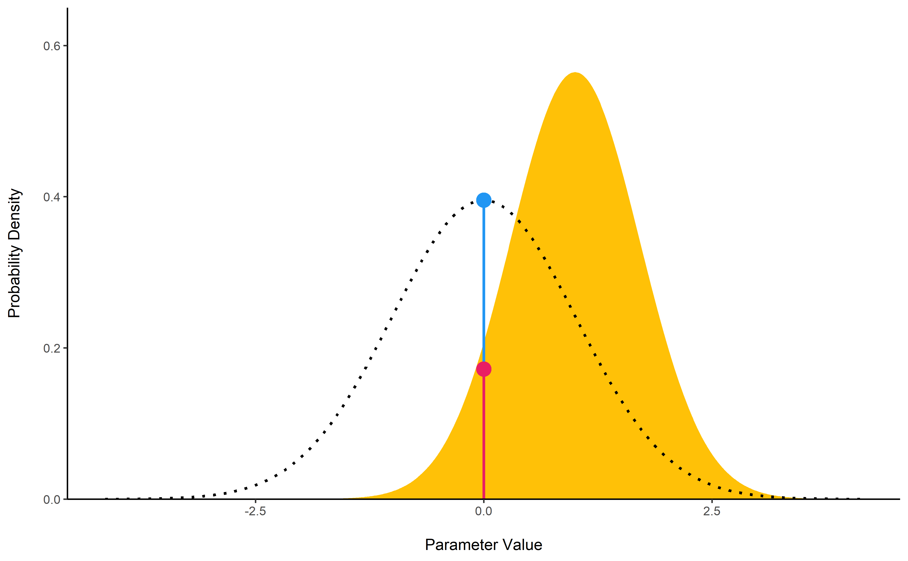

# bayestestR 

[](https://cran.r-project.org/package=bayestestR)
[](https://cran.r-project.org/package=bayestestR)
[](https://travis-ci.org/easystats/bayestestR)
[](https://codecov.io/gh/easystats/bayestestR)
[](https://doi.org/10.21105/joss.01541)

***Become a Bayesian master you will***

Existing R packages allow users to easily fit a large variety of models
and extract and visualize the posterior draws. However, most of these
packages only return a limited set of indices (e.g., point-estimates and
CIs). **bayestestR** provides a comprehensive and consistent set of
functions to analyze and describe posterior distributions generated by a
variety of models objects, including popular modeling packages such as
**rstanarm**, **brms** or **BayesFactor**.

You can reference the package and its documentation as follows:

  - Makowski, D., Ben-Shachar, M. S., & Lüdecke, D. (2019). *bayestestR:
    Describing Effects and their Uncertainty, Existence and Significance
    within the Bayesian Framework*. Journal of Open Source Software,
    4(40), 1541.
    [10.21105/joss.01541](https://doi.org/10.21105/joss.01541)
  - Makowski, D., Ben-Shachar, M. S., Chen, S. H. A., & Lüdecke, D.
    (2019). *Indices of Effect Existence and Significance in the
    Bayesian Framework*. Frontiers in Psychology 2019;10:2767.
    [10.3389/fpsyg.2019.02767](https://doi.org/10.3389/fpsyg.2019.02767)

## Installation

Run the following:

``` r
install.packages("bayestestR")
```

## Documentation

[](https://easystats.github.io/bayestestR/)
[](https://easystats.github.io/blog/posts/)
[](https://easystats.github.io/bayestestR/reference/index.html)

Click on the buttons above to access the package
[**documentation**](https://easystats.github.io/bayestestR/) and the
[**easystats blog**](https://easystats.github.io/blog/posts/), and
check-out these vignettes:

#### Tutorials

  - [Get Started with Bayesian
    Analysis](https://easystats.github.io/bayestestR/articles/bayestestR.html)
  - [Example 1: Initiation to Bayesian
    models](https://easystats.github.io/bayestestR/articles/example1.html)
  - [Example 2: Confirmation of Bayesian
    skills](https://easystats.github.io/bayestestR/articles/example2.html)
  - [Example 3: Become a Bayesian
    master](https://easystats.github.io/bayestestR/articles/example3.html)

#### Articles

  - [Credible Intervals
    (CI)](https://easystats.github.io/bayestestR/articles/credible_interval.html)
  - [Probability of Direction
    (pd)](https://easystats.github.io/bayestestR/articles/probability_of_direction.html)
  - [Region of Practical Equivalence
    (ROPE)](https://easystats.github.io/bayestestR/articles/region_of_practical_equivalence.html)
  - [Bayes Factors
    (BF)](https://easystats.github.io/bayestestR/articles/bayes_factors.html)
  - [Comparison of
    Point-Estimates](https://easystats.github.io/bayestestR/articles/indicesEstimationComparison.html)
  - [Comparison of Indices of Effect
    Existence](https://easystats.github.io/bayestestR/articles/indicesExistenceComparison.html)
  - [Reporting
    Guidelines](https://easystats.github.io/bayestestR/articles/guidelines.html)

# Features

In the Bayesian framework, parameters are estimated in a probabilistic
fashion as *distributions*. These distributions can be summarised and
described by **reporting 4 types of indices**:

  - [**Centrality**](https://easystats.github.io/bayestestR/articles/indicesEstimationComparison.html)
      - `mean()`, `median()` or
        [**`map_estimate()`**](https://easystats.github.io/bayestestR/reference/map_estimate.html)
        for an estimation of the mode.
      - [**`point_estimate()`**](https://easystats.github.io/bayestestR/reference/point_estimate.html)
        can be used to get them at once and can be run directly on
        models.
  - [**Uncertainty**](https://easystats.github.io/bayestestR/articles/credible_interval.html)
      - [**`hdi()`**](https://easystats.github.io/bayestestR/reference/hdi.html)
        for *Highest Density Intervals (HDI)* or
        [**`eti()`**](https://easystats.github.io/bayestestR/reference/eti.html)
        for *Equal-Tailed Intervals (ETI)*.
      - [**`ci()`**](https://easystats.github.io/bayestestR/reference/ci.html)
        can be used as a general method for Confidence and Credible
        Intervals (CI).
  - [**Effect
    Existence**](https://easystats.github.io/bayestestR/articles/indicesExistenceComparison.html):
    whether an effect is different from 0.
      - [**`p_direction()`**](https://easystats.github.io/bayestestR/reference/p_direction.html)
        for a Bayesian equivalent of the frequentist *p*-value (see
        [Makowski et
        al., 2019](https://doi.org/10.3389/fpsyg.2019.02767))
      - [**`p_pointnull()`**](https://easystats.github.io/bayestestR/reference/p_map.html)
        represents the odds of null hypothesis (*h0 = 0*) compared to
        the most likely hypothesis (the MAP).
      - [**`bf_pointnull()`**](https://easystats.github.io/bayestestR/reference/bayesfactor_parameters.html)
        for a classic *Bayes Factor (BF)* assessing the likelihood of
        effect presence against its absence (*h0 = 0*).
  - [**Effect
    Significance**](https://easystats.github.io/bayestestR/articles/indicesExistenceComparison.html):
    whether the effect size can be considered as non-negligible.
      - [**`p_rope()`**](https://easystats.github.io/bayestestR/reference/p_rope.html)
        is the probability of the effect falling inside a [*Region of
        Practical Equivalence
        (ROPE)*](https://easystats.github.io/bayestestR/articles/region_of_practical_equivalence.html).
      - [**`bf_rope()`**](https://easystats.github.io/bayestestR/reference/bayesfactor_parameters.html)
        computes a Bayes factor against the null as defined by a region
        (the ROPE).
      - [**`p_significance()`**](https://easystats.github.io/bayestestR/reference/p_significance.html)
        that combines a region of equivalence with the probability of
        direction.

[**`describe_posterior()`**](https://easystats.github.io/bayestestR/reference/describe_posterior.html)
is the master function with which you can compute all of the indices
cited below at once.

``` r
describe_posterior(
  rnorm(10000),
  centrality = "median",
  test = c("p_direction", "p_significance")
)
## # Description of Posterior Distributions
## 
## Parameter | Median |          89% CI |    pd |    ps
## ----------------------------------------------------
## Posterior | -0.009 | [-1.574, 1.608] | 0.502 | 0.467
```

`describe_posterior()` works for many objects, including more complex
*brmsfit*-models. For better readability, the output is separated by
model components:

``` r
zinb <- read.csv("http://stats.idre.ucla.edu/stat/data/fish.csv")
set.seed(123)
model <- brm(
  bf(
    count ~ child + camper + (1 | persons), 
    zi ~ child + camper + (1 | persons)
  ),
  data = zinb,
  family = zero_inflated_poisson(),
  chains = 1,
  iter = 500
)

describe_posterior(
  model,
  effects = "all",
  component = "all",
  test = c("p_direction", "p_significance"),
  centrality = "all"
)
```

    ## # Description of Posterior Distributions
    ## 
    ## # Fixed Effects (Conditional Model)
    ## 
    ## Parameter | Median |   Mean |    MAP |           89% CI |    pd |    ps |  Rhat |     ESS
    ## -----------------------------------------------------------------------------------------
    ## Intercept |  1.319 |  1.186 |  1.450 | [ 0.049,  2.275] | 0.940 | 0.920 | 1.005 |  78.167
    ## child     | -1.162 | -1.162 | -1.175 | [-1.320, -0.980] | 1.000 | 1.000 | 0.996 | 171.633
    ## camper    |  0.727 |  0.731 |  0.737 | [ 0.587,  0.858] | 1.000 | 1.000 | 0.996 | 232.866
    ## 
    ## # Fixed Effects (Zero-Inflated Model)
    ## 
    ## Parameter | Median |   Mean |    MAP |           89% CI |    pd |    ps |  Rhat |     ESS
    ## -----------------------------------------------------------------------------------------
    ## Intercept | -0.778 | -0.731 | -0.890 | [-1.893,  0.218] | 0.876 | 0.840 | 1.004 |  92.075
    ## child     |  1.888 |  1.882 |  1.906 | [ 1.302,  2.304] | 1.000 | 1.000 | 1.015 |  72.077
    ## camper    | -0.840 | -0.838 | -0.778 | [-1.337, -0.231] | 0.992 | 0.988 | 0.998 | 182.409
    ## 
    ## # Random Effects (Conditional Model)
    ## 
    ## Parameter              | Median |   Mean |    MAP |           89% CI |    pd |    ps |  Rhat |    ESS
    ## -----------------------------------------------------------------------------------------------------
    ## persons 1              | -1.315 | -1.233 | -1.397 | [-2.555, -0.031] | 0.940 | 0.924 | 1.004 | 80.071
    ## persons 2              | -0.380 | -0.264 | -0.542 | [-1.451,  1.008] | 0.660 | 0.632 | 1.006 | 78.483
    ## persons 3              |  0.307 |  0.438 |  0.136 | [-0.728,  1.588] | 0.708 | 0.644 | 1.003 | 76.611
    ## persons 4              |  1.207 |  1.331 |  1.030 | [ 0.290,  2.537] | 0.960 | 0.960 | 1.004 | 77.942
    ## SD persons (Intercept) |  1.404 |  1.676 |  1.093 | [ 0.613,  3.104] | 1.000 | 1.000 | 0.998 | 46.823
    ## 
    ## # Random Effects (Zero-Inflated Model)
    ## 
    ## Parameter              | Median |   Mean |    MAP |           89% CI |    pd |    ps |  Rhat |     ESS
    ## ------------------------------------------------------------------------------------------------------
    ## persons 1              |  1.355 |  1.319 |  1.366 | [ 0.368,  2.659] | 0.956 | 0.952 | 1.005 |  90.937
    ## persons 2              |  0.382 |  0.357 |  0.509 | [-0.726,  1.488] | 0.724 | 0.668 | 1.000 |  98.925
    ## persons 3              | -0.117 | -0.142 | -0.103 | [-1.162,  1.128] | 0.580 | 0.512 | 0.997 |  93.931
    ## persons 4              | -1.166 | -1.270 | -1.024 | [-2.462, -0.061] | 0.972 | 0.960 | 0.997 | 113.328
    ## SD persons (Intercept) |  1.484 |  1.749 |  1.162 | [ 0.463,  3.094] | 1.000 | 1.000 | 1.006 |  68.790

*bayestestR* also includes [**many other
features**](https://easystats.github.io/bayestestR/reference/index.html)
useful for your Bayesian analsyes. Here are some more examples:

## Point-estimates

``` r
library(bayestestR)

posterior <- distribution_gamma(10000, 1.5)  # Generate a skewed distribution
centrality <- point_estimate(posterior)  # Get indices of centrality
centrality
## # Point Estimates
## 
## Median | Mean |  MAP
## --------------------
##   1.18 | 1.50 | 0.51
```

As for other [**easystats**](https://github.com/easystats) packages,
`plot()` methods are available from the
[**see**](http://easystats.github.io/see) package for many functions:

<!-- -->

While the **median** and the **mean** are available through base R
functions,
[**`map_estimate()`**](https://easystats.github.io/bayestestR/reference/map_estimate.html)
in *bayestestR* can be used to directly find the **Highest Maximum A
Posteriori (MAP)** estimate of a posterior, *i.e.*, the value associated
with the highest probability density (the “peak” of the posterior
distribution). In other words, it is an estimation of the *mode* for
continuous parameters.

## Uncertainty (CI)

[**`hdi()`**](https://easystats.github.io/bayestestR/reference/hdi.html)
computes the **Highest Density Interval (HDI)** of a posterior
distribution, i.e., the interval which contains all points within the
interval have a higher probability density than points outside the
interval. The HDI can be used in the context of Bayesian posterior
characterization as **Credible Interval (CI)**.

Unlike equal-tailed intervals (see
[`eti()`](https://easystats.github.io/bayestestR/reference/eti.html))
that typically exclude 2.5% from each tail of the distribution, the HDI
is *not* equal-tailed and therefore always includes the mode(s) of
posterior distributions.

By default, `hdi()` returns the 89% intervals (`ci = 0.89`), deemed to
be more stable than, for instance, 95% intervals. An effective sample
size of at least 10.000 is recommended if 95% intervals should be
computed (Kruschke, 2015). Moreover, 89 indicates the arbitrariness of
interval limits - its only remarkable property is being the highest
prime number that does not exceed the already unstable 95% threshold
(McElreath, 2018).

``` r
posterior <- distribution_chisquared(10000, 4)

hdi(posterior, ci = .89)
## # Highest Density Interval
## 
## 89% HDI     
## ------------
## [0.18, 7.63]

eti(posterior, ci = .89)
## # Equal-Tailed Interval
## 
## 89% ETI     
## ------------
## [0.75, 9.25]
```

<!-- -->

## Existence and Significance Testing

### Probability of Direction (*pd*)

[**`p_direction()`**](https://easystats.github.io/bayestestR/reference/p_direction.html)
computes the **Probability of Direction** (***p*d**, also known as the
Maximum Probability of Effect - *MPE*). It varies between 50% and 100%
(*i.e.*, `0.5` and `1`) and can be interpreted as the probability
(expressed in percentage) that a parameter (described by its posterior
distribution) is strictly positive or negative (whichever is the most
probable). It is mathematically defined as the proportion of the
posterior distribution that is of the median’s sign. Although
differently expressed, this index is fairly similar (*i.e.*, is strongly
correlated) to the frequentist ***p*-value**.

**Relationship with the p-value**: In most cases, it seems that the *pd*
corresponds to the frequentist one-sided *p*-value through the formula
`p-value = (1-pd/100)` and to the two-sided *p*-value (the most commonly
reported) through the formula `p-value = 2*(1-pd/100)`. Thus, a `pd` of
`95%`, `97.5%` `99.5%` and `99.95%` corresponds approximately to a
two-sided *p*-value of respectively `.1`, `.05`, `.01` and `.001`. See
the [*reporting
guidelines*](https://easystats.github.io/bayestestR/articles/guidelines.html).

``` r
posterior <- distribution_normal(10000, 0.4, 0.2)
p_direction(posterior)
## pd = 97.73%
```

<!-- -->

### ROPE

[**`rope()`**](https://easystats.github.io/bayestestR/reference/rope.html)
computes the proportion (in percentage) of the HDI (default to the 89%
HDI) of a posterior distribution that lies within a region of practical
equivalence.

Statistically, the probability of a posterior distribution of being
different from 0 does not make much sense (the probability of it being
different from a single point being infinite). Therefore, the idea
underlining ROPE is to let the user define an area around the null value
enclosing values that are *equivalent to the null* value for practical
purposes (Kruschke & Liddell, 2018, p. @kruschke2018rejecting).

Kruschke suggests that such null value could be set, by default, to the
-0.1 to 0.1 range of a standardized parameter (negligible effect size
according to Cohen, 1988). This could be generalized: For instance, for
linear models, the ROPE could be set as `0 +/- .1 * sd(y)`. This ROPE
range can be automatically computed for models using the
[rope\_range](https://easystats.github.io/bayestestR/reference/rope_range.html)
function.

Kruschke suggests using the proportion of the 95% (or 90%, considered
more stable) HDI that falls within the ROPE as an index for
“null-hypothesis” testing (as understood under the Bayesian framework,
see
[equivalence\_test](https://easystats.github.io/bayestestR/reference/equivalence_test.html)).

``` r
posterior <- distribution_normal(10000, 0.4, 0.2)
rope(posterior, range = c(-0.1, 0.1))
## # Proportion of samples inside the ROPE [-0.10, 0.10]:
## 
## inside ROPE
## -----------
## 1.33 %
```

<!-- -->

### Bayes Factor

[**`bayesfactor_parameters()`**](https://easystats.github.io/bayestestR/reference/bayesfactor_parameters.html)
computes Bayes factors against the null (either a point or an interval),
bases on prior and posterior samples of a single parameter. This Bayes
factor indicates the degree by which the mass of the posterior
distribution has shifted further away from or closer to the null
value(s) (relative to the prior distribution), thus indicating if the
null value has become less or more likely given the observed data.

When the null is an interval, the Bayes factor is computed by comparing
the prior and posterior odds of the parameter falling within or outside
the null; When the null is a point, a Savage-Dickey density ratio is
computed, which is also an approximation of a Bayes factor comparing the
marginal likelihoods of the model against a model in which the tested
parameter has been restricted to the point null (Wagenmakers, Lodewyckx,
Kuriyal, & Grasman, 2010).

``` r
prior <- distribution_normal(10000, mean = 0, sd = 1)
posterior <- distribution_normal(10000, mean = 1, sd = 0.7)

bayesfactor_parameters(posterior, prior, direction = "two-sided", null = 0)
## # Bayes Factor (Savage-Dickey density ratio)
## 
## BF   
## -----
## 1.946
## 
## * Evidence Against The Null: [0]
```

<!-- -->

<sup>*The lollipops represent the density of a point-null on the prior
distribution (the blue lollipop on the dotted distribution) and on the
posterior distribution (the red lollipop on the yellow distribution).
The ratio between the two - the Savage-Dickey ratio - indicates the
degree by which the mass of the parameter distribution has shifted away
from or closer to the null.*</sup>

For more info, see [the Bayes factors
vignette](https://easystats.github.io/bayestestR/articles/bayes_factors.html).

## Utilities

### Find ROPE’s appropriate range

[**`rope_range()`**](https://easystats.github.io/bayestestR/reference/rope_range.html):
This function attempts at automatically finding suitable “default”
values for the Region Of Practical Equivalence (ROPE). Kruschke (2018)
suggests that such null value could be set, by default, to a range from
`-0.1` to `0.1` of a standardized parameter (negligible effect size
according to Cohen, 1988), which can be generalised for linear models to
`-0.1 * sd(y), 0.1 * sd(y)`. For logistic models, the parameters
expressed in log odds ratio can be converted to standardized difference
through the formula `sqrt(3)/pi`, resulting in a range of `-0.05` to
`0.05`.

``` r
rope_range(model)
```

### Density Estimation

[**`estimate_density()`**](https://easystats.github.io/bayestestR/reference/estimate_density.html):
This function is a wrapper over different methods of density estimation.
By default, it uses the base R `density` with by default uses a
different smoothing bandwidth (`"SJ"`) from the legacy default
implemented the base R `density` function (`"nrd0"`). However, Deng &
Wickham suggest that `method = "KernSmooth"` is the fastest and the most
accurate.

### Perfect Distributions

[**`distribution()`**](https://easystats.github.io/bayestestR/reference/distribution.html):
Generate a sample of size n with near-perfect distributions.

``` r
distribution(n = 10)
##  [1] -1.28 -0.88 -0.59 -0.34 -0.11  0.11  0.34  0.59  0.88  1.28
```

### Probability of a Value

[**`density_at()`**](https://easystats.github.io/bayestestR/reference/density_at.html):
Compute the density of a given point of a distribution.

``` r
density_at(rnorm(1000, 1, 1), 1)
## [1] 0.39
```

# References

<div id="refs" class="references">

<div id="ref-kruschke2015doing">

Kruschke, J. K. (2015). *Doing Bayesian data analysis: A tutorial with
R, JAGS, and Stan* (2. ed). Amsterdam: Elsevier, Academic Press.

</div>

<div id="ref-kruschke2018rejecting">

Kruschke, J. K. (2018). Rejecting or accepting parameter values in
Bayesian estimation. *Advances in Methods and Practices in Psychological
Science*, *1*(2), 270–280. <https://doi.org/10.1177/2515245918771304>

</div>

<div id="ref-kruschke2018bayesian">

Kruschke, J. K., & Liddell, T. M. (2018). The Bayesian new statistics:
Hypothesis testing, estimation, meta-analysis, and power analysis from a
Bayesian perspective. *Psychonomic Bulletin & Review*, *25*(1), 178–206.
<https://doi.org/10.3758/s13423-016-1221-4>

</div>

<div id="ref-mcelreath2018statistical">

McElreath, R. (2018). *Statistical rethinking*.
<https://doi.org/10.1201/9781315372495>

</div>

<div id="ref-wagenmakers2010bayesian">

Wagenmakers, E.-J., Lodewyckx, T., Kuriyal, H., & Grasman, R. (2010).
Bayesian hypothesis testing for psychologists: A tutorial on the
SavageDickey method. *Cognitive Psychology*, *60*(3), 158–189.
<https://doi.org/10.1016/j.cogpsych.2009.12.001>

</div>

</div>
