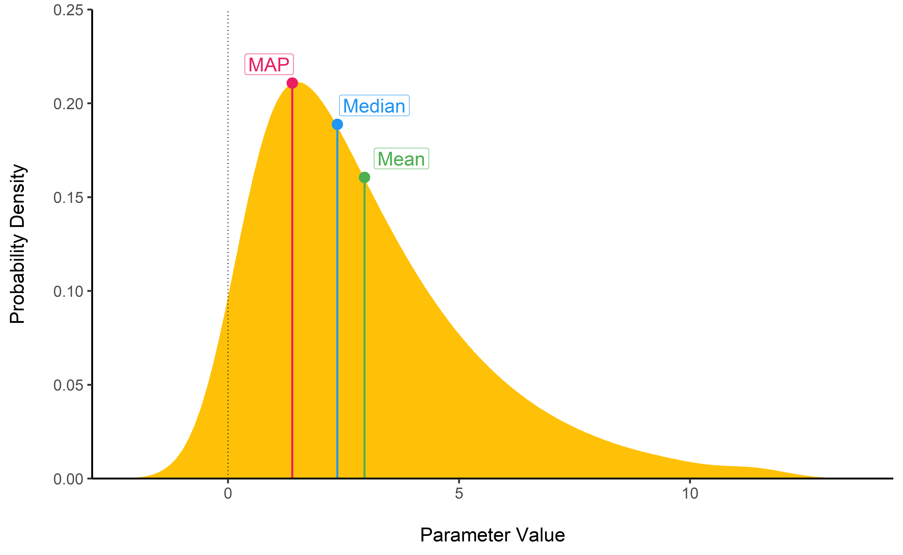
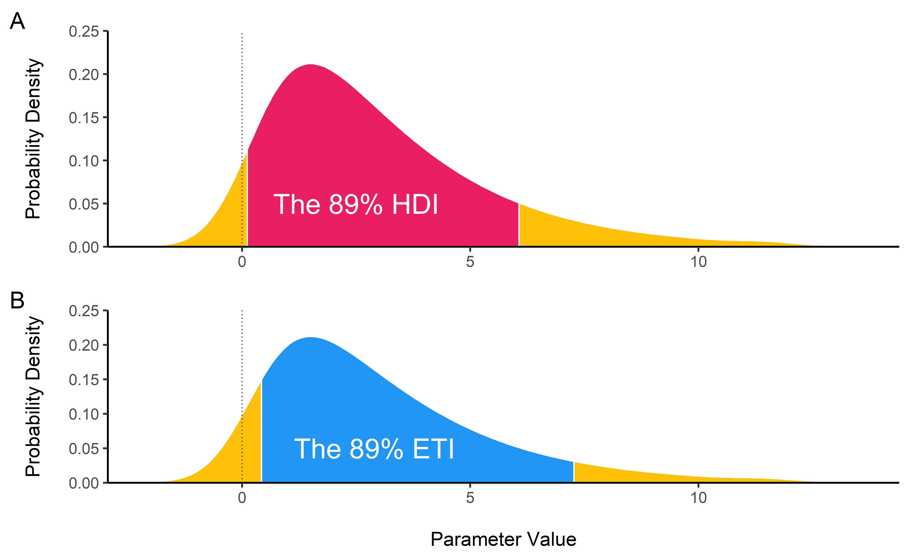
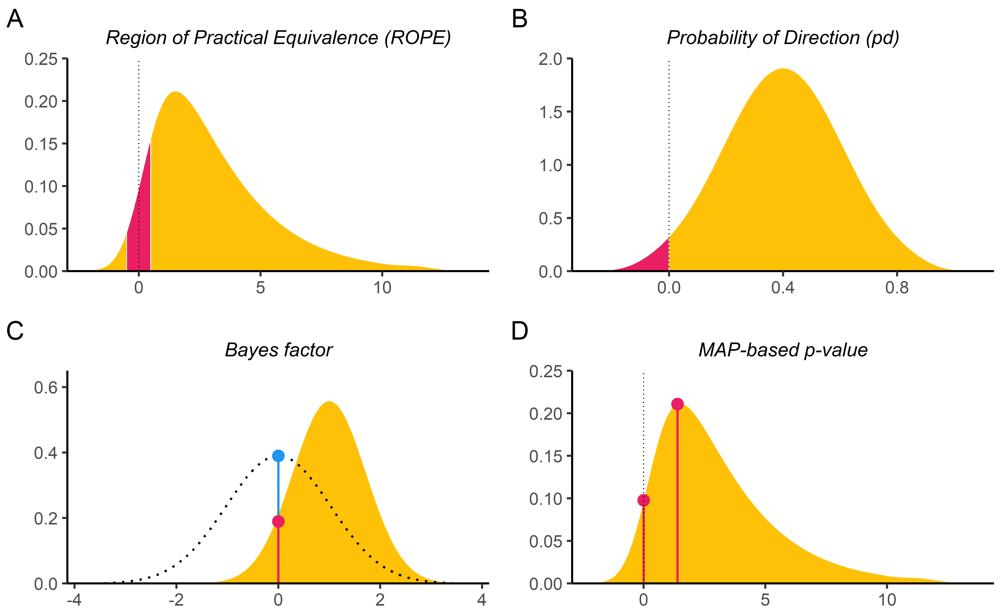

# Introduction

The Bayesian framework for statistics is quickly gaining in popularity among scientists, for reasons such as reliability and accuracy (particularly in noisy data and small samples), the possibility of incorporating prior knowledge into the analysis and the intuitive interpretation of results [@andrews2013prior; @etz2016bayesian; @kruschke2010believe; @kruschke2012time; @wagenmakers2018bayesian]. Adopting the Bayesian framework is more of a shift in the paradigm than a change in the methodology; All the common statistical procedures (*t*-tests, correlations, ANOVAs, regressions, etc.) can also be achieved within the Bayesian framework. One of the core difference is that in the *frequentist* view, the effects are fixed (but unknown) and data are random. On the other hand, instead of having single estimates of the "true effect", the Bayesian inference process computes the probability of different effects *given the observed data*, resulting in a distribution of possible values for the parameters, called the *posterior distribution*. 

Effects in the Bayesian framework can be described by [characterizing their posterior distribution](https://easystats.github.io/bayestestR/articles/guidelines.html). Commonly reported indices include measures of centrality (e.g., the median, mean or MAP) and uncertainty (the [*credible* interval](https://easystats.github.io/bayestestR/articles/credible_interval.html)). *Cum grano salis*, these are considered the counterparts to the coefficient point-estimates and confidence intervals of the frequentist framework. Additionally, `bayestestR` also focuses on implementing a Bayesian null-hypothesis testing framework (in a Bayesian meaning, i.e., extended to general testing of "effect existence") by providing access to both established and exploratory indices of effect *existence* and *significance* (such as the ROPE, @kruschke2018bayesian; the MAP-based *p* value, @mills2018objective; or the Probability of Direction - *pd*).

Existing R packages allow users to easily fit a large variety of models and extract and visualize the posterior draws. However, most of these packages only return a limited set of indices (e.g., point-estimates and CIs). `bayestestR` provides a comprehensive and consistent set of functions to analyze and describe posterior distributions generated by a variety of models objects, including popular modeling packages such as `rstanarm` [@goodrich2018rstanarm], `brms` [@burkner2017brms] or `BayesFactor` [@morey2014bayesfactor], thus appearing as a useful tool supporting the usage and developpment of Bayesian statistics. The main functions are described below, and a full documentation is available on the [package's website](https://easystats.github.io/bayestestR).

# Examples of Features

The following demonstration of functions in `bayestestR` is accompanied by figures to illustrate the conceptional ideas behind the related indices. However, `bayestestR` functions also include plotting capabilities via the [**see** package](https://easystats.github.io/see/) [@ludecke2019see].

## Indices of Centrality: Point-estimates

`bayestestR` offers two functions to compute point-estimates from posterior distributions: `map_estimate()` and `point_estimate()`, the latter providing options to calculate the mean, median or MAP estimate of a posterior distribution. [`map_estimate()`](https://easystats.github.io/bayestestR/reference/map_estimate.html) is a convenient function to calculate the MAP estimate directly.

The **posterior mean** minimizes expected _squared_ error, whereas the **posterior median** minimizes expected _absolute_ error (i.e. the difference of estimates from true values over samples). The highest **Maximum A Posteriori** (MAP) estimate is the most probable value of a posterior distribution.

``` r
set.seed(1)
posterior <- rchisq(100, 3)
map_estimate(posterior)
#> MAP = 1.46

point_estimate(posterior)
#> Median = 2.31

point_estimate(posterior, centrality = "mean")
#> Mean = 2.96

point_estimate(posterior, centrality = "map")
#> MAP = 1.46
```

<!-- -->
*Figure 1. Indices of centrality of the posterior distribution: the mean (in green), median (in red), and MAP (in blue).*

## Indices of Uncertainty: HDI and CI

To measure the uncertainty in the estimation, `bayestestR` provides two functions: `ci()`, the "classical", equal-tailed credible interval, and `hdi()`, the highest density interval. 

[**`hdi()`**](https://easystats.github.io/bayestestR/reference/hdi.html)
computes the **Highest Density Interval (HDI)** of a posterior distribution, i.e., the interval which contains all points within the interval have a higher probability density than points outside the interval. The HDI can be used in the context of Bayesian posterior characterisation as **Credible Interval (CI)**, however, HDIs have a particular property: Unlike equal-tailed intervals (see [`ci()`](https://easystats.github.io/bayestestR/reference/ci.html)) that typically exclude 2.5% from each tail of the distribution, the HDI is *not* equal-tailed and therefore always includes the mode(s) of posterior distributions.

By default, `hdi()` and `ci()` return the 89% intervals (`ci = 0.89`), deemed to be more stable than, for instance, 95% intervals. An effective sample size of at least 10.000 is recommended if 95% intervals should be computed [@kruschke2015doing]. Moreover, 89 is the highest prime number that does not exceed the already unstable 95% threshold [@mcelreath2018statistical].

``` r
hdi(posterior)
#> # Highest Density Interval
#> 
#>       89% HDI
#>  [0.11, 6.05]

ci(posterior)
#> # Credible Interval
#> 
#>        89% CI
#>  [0.42, 7.27]
```

<!-- -->
*Figure 2. Indices of uncertainty of the posterior distribution: (A) the 89% HDI; (B) the 89% CI.*

## Null-Hypothesis Significance Testing (NHST)

### ROPE

[**`rope()`**](https://easystats.github.io/bayestestR/reference/rope.html) computes the proportion (in percentage) of the HDI (default to the 89% HDI) of a posterior distribution that lies within a region of practical equivalence.

Statistically, the probability of a posterior distribution of being different from 0 does not make much sense (the probability of it being different from a single point being infinite). Therefore, the idea
underlining ROPE is to let the user define an area around the null value enclosing values that are *equivalent to the null* value for practical purposes [@kruschke2018bayesian; @kruschke2018rejecting].

Kruschke suggests that such null value could be set, by default, to the -0.1 to 0.1 range of a standardized parameter (negligible effect size according to Cohen, 1988). This could be generalized: For instance,
for linear models, the ROPE could be set as `0 +/- .1 * sd(y)`. This ROPE range can be automatically computed for models using the [rope\_range](https://easystats.github.io/bayestestR/reference/rope_range.html) function.

The proportion of the 95% HDI (or 90%, considered more stable) that falls within the ROPE can be used as an index for "null-hypothesis" testing (as understood under the Bayesian framework, see
[equivalence\_test](https://easystats.github.io/bayestestR/reference/equivalence_test.html)).

``` r
rope(posterior, range = c(-0.5, 0.5))
#> # Proportion of samples inside the ROPE [-0.50, 0.50]:
#> 
#>  inside ROPE
#>       8.89 %
```

<!-- -->
*Figrue 3. Null-Hypothesis Significance Testing: (A) The ROPE; (B) Probability of direction; (C) The Savage-Dickey Bayes factor; (D) The p-MAP.*

### Test for Practical Equivalence

[**`equivalence_test()`**](https://easystats.github.io/bayestestR/reference/equivalence_test.html)
is a **Test for Practical Equivalence** based on the “HDI+ROPE decision rule” [@kruschke2018rejecting] to check whether parameter values should be accepted or rejected against an explicitly formulated “null hypothesis” (i.e., a [ROPE](https://easystats.github.io/bayestestR/reference/rope.html)).

The percentage of the HDI that falls within the ROPE serves as decision rule: If the HDI is completely outside the ROPE, the "null hypothesis" for this parameter is "rejected". If the ROPE completely covers the HDI, i.e., all most credible values of a parameter are inside the region of practical equivalence, the null hypothesis is accepted. Else, it’s undecided whether to accept or reject the null hypothesis.

``` r
library(rstanarm)
model <- stan_glm(mpg ~ wt + gear, data = mtcars)
equivalence_test(model)
#> # Test for Practical Equivalence
#> 
#>   ROPE: [-0.60 0.60]
#> 
#>    Parameter        H0 inside ROPE       89% HDI
#>  (Intercept)  Rejected      0.00 % [30.82 47.02]
#>           wt  Rejected      0.00 % [-6.63 -4.39]
#>         gear Undecided     52.54 % [-1.76  1.23]
```

As said above, for regression models `equivalence_test()` will automatically find an appropriate range for the ROPE. However, it is also possible to define a custom range using the `range`-argument.

``` r
equivalence_test(posterior, range = c(-0.5, 0.5))
#> # Test for Practical Equivalence
#> 
#>   ROPE: [-0.50 0.50]
#> 
#>         H0 inside ROPE     89% HDI
#>  Undecided      8.89 % [0.11 6.05]
```

### Probability of Direction (*p*d)

[**`p_direction()`**](https://easystats.github.io/bayestestR/reference/p_direction.html) computes the **Probability of Direction** (*pd*, also known as the Maximum Probability of Effect - *MPE*). It varies between 50% and 100% (i.e., `0.5` and `1`) and can be interpreted as the probability (expressed in percentage) that a parameter (described by its posterior distribution) is strictly positive or negative (whichever is the most probable). It is mathematically defined as the proportion of the posterior distribution that is of the median's sign.

The demonstration of the *pd* only makes sense for distributions that in principle can have both positive and negative values, so for the next example a normal distribution is used with values approximately ranging from `-.1` to `.9`.

``` r
p_direction(distribution_normal(100, 0.4, 0.2))
#> # Probability of Direction (pd)
#> 
#> pd = 98.00%
```

### Bayes Factor

[**`bayesfactor_savagedickey()`**](https://easystats.github.io/bayestestR/reference/bayesfactor_savagedickey.html)
computes the ratio between the density of a single value (typically the
null) in two distributions. When these distributions are the prior and the posterior
distributions, this ratio can be used to examine the degree by which the mass of
the posterior distribution has shifted further away from or closer to the null value
(relative to the prior distribution), thus indicating if the null value has become
less or more likely given the observed data. The Savage-Dickey density ratio is
also an approximation of a Bayes factor comparing the marginal likelihoods of
the model against a model in which the tested parameter has been restricted to
the point null [@wagenmakers2010bayesian].

``` r
prior <- rnorm(1000, mean = 0, sd = 1)
posterior <- rnorm(1000, mean = 1, sd = 0.7)

bayesfactor_savagedickey(posterior, prior, direction = "two-sided", hypothesis = 0)
```

### MAP-based *p*-value

[**`p_map()`**](https://easystats.github.io/bayestestR/reference/p_map.html) computes a Bayesian equivalent of the p-value, related to the odds that a parameter (described by its posterior distribution) has against the null hypothesis (*h0*) using Mills’ (2014, 2017) *Objective Bayesian Hypothesis Testing* framework. It is mathematically based on the density at the Maximum A Priori (MAP) and corresponds to the density value at 0 divided by the density of the MAP estimate.

``` r
p_map(posterior)
#> # MAP-based p-value
#> 
#> p (MAP) = 0.000
```

# Licensing and Availability

**bayestestR** is licensed under the GNU General Public License (v3.0), with all source code stored at GitHub (https://github.com/easystats/bayestestR), with a corresponding issue tracker for bug-reporting and feature enhancements. In the spirit of honest and open science, we encourage requests/tips for fixes, feature updates, as well as general questions and concerns via direct interaction with contributors and developers.

# Acknowledgments

`bayestestR` is part of the [*easystats*](`https://github.com/easystats/easystats`) ecosystem (relying on the `insight` package to access information contained in models; @ludecke2019insight), a collaborative project created to facilitate the usage of R. Thus, we would like to thank the [council of masters](https://github.com/orgs/easystats/people) of easystats, all other padawan contributors, as well as the users.

# References